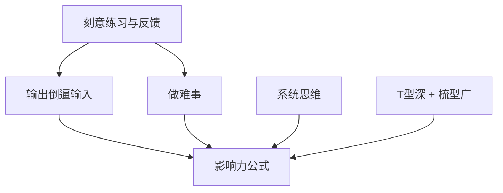

# 心法与原则索引

> 技术可以过时，心法永不过时。
> 大拿与普通人的差距，往往不在「知道多少」，而在于「用什么底层逻辑做决策」。

本索引收集那些被反复验证、可以指导 5-10 年职业生涯的**心智模型**与**原则**。

---

## 核心心法地图（推荐阅读顺序）

---

## 必读心法（v1 核心）

### 1. 刻意练习与及时反馈

- **一句话**：普通人靠天赋和重复，大拿靠刻意练习 + 即时、残酷的反馈。
- **核心洞见**：光「多写代码」不够，必须针对自己的薄弱环节设计练习，并找到能给你真实反馈的场景（开源、review、线上问题、教学）。
- **阅读入口**：[[刻意练习与及时反馈]]

**标签**：#心法/刻意练习 #心法/反馈 #阶段/全周期

---

### 2. 输出倒逼输入

- **一句话**：写出来、讲出来、开源出来，是最高效的深度理解方式。
- **核心洞见**：大拿几乎无一例外是高产出者。输出不是「锦上添花」，而是「理解的最后一公里」。
- **阅读入口**：[[输出倒逼输入]]

**标签**：#心法/输出 #影响力/写作 #影响力/开源

**真实案例**：[[左耳朵耗子]] 用 15 年持续写作证明了这个杠杆的威力；[[阮一峰]] 用系统化教育输出把「把复杂讲清楚」做成了长期影响力。

---

### 3. 做难事：突破舒适区

- **一句话**：业务代码永远是「小怪」，大拿是靠持续主动做「大怪」长大的。
- **核心洞见**：李运华反复强调「Do More + Do Better」。大多数人的天花板，不是能力，而是「选择」。
- **阅读入口**：[[做难事：突破舒适区]]

**标签**：#心法/勇气 #心法/选择 #阶段/3-7年

---

### 4. 系统思维与全链路视角

- **一句话**：从浏览器到数据库、从需求到上线、从代码到组织——大拿永远在更高的抽象层看问题。
- **核心洞见**：当你能把整个链路装进脑子里时，你的方案和判断力会发生质变。
- **阅读入口**：[[系统思维与全链路视角]]

**已上线**（2026-06）：完整高质量文章，强烈推荐与李运华、左耳朵耗子一起读。

### 7. 项目驱动学习法（新增）

- **一句话**：把真实工作项目当作最高质量的刻意练习场和全链路训练场。
- **核心洞见**：工作本身远比下班后的学习效率高，前提是你要主动选项目、设定学习目标、强制复盘。
- **阅读入口**：[[项目驱动学习法]]

**标签**：#心法/学习方法 #阶段/3-7年

**已上线**（2026-06）：完整文章，强烈建议与「做难事」「全链路视角」一起实践。

**标签**：#心法/系统思维 #心法/架构 #阶段/突破期

---

### 5. 影响力 = 深度 × 持续输出 × 连接

- **一句话**：影响力不是「人脉」，而是「别人在解决某个问题时，会不会想到你」。
- **核心洞见**：冯大辉、阮一峰、Carmack 等人的共同点——他们在某个垂直领域长期深耕 + 持续公开输出 + 主动连接社区。
- **阅读入口**：[[影响力 = 深度 × 持续输出 × 连接]]

**标签**：#心法/影响力 #影响力/品牌

---

### 6. T型深 + 梳型广（专家的形状）

- **一句话**：纯 T 型（一深到底）容易被时代淘汰，纯广容易浅；大拿是「T 底 + 多把梳子」。
- **核心洞见**：先在一个领域打到别人绕不开你，再横向迁移范式。
- **阅读入口**：[[T型深 + 梳型广]]

**标签**：#心法/专家形状 #心法/职业规划

**真实案例**：[[丁奇]] 把数据库内核（尤其是 InnoDB）深到极致，再横向迁移到分布式数据库领域；[[Rich Hickey]] 用「Simple Made Easy」重新定义了软件复杂度的哲学边界。

---

## 思维模型心法（2026-07 新增）

### 8. 第一性原理：从基本事实重新推导

- **一句话**：不要问「别人怎么做」，问「物理上什么是可能的」，然后从基本事实重新推导最优解。
- **核心洞见**：类比思维让你永远在已有解空间里打转。第一性原理是打破天花板的唯一工具。
- **阅读入口**：[[第一性原理：从基本事实重新推导]]
- **相关人物**：[[Elon Musk]] · [[John Carmack]] · [[Rich Hickey]] · [[梁文锋]]

**标签**：#心法/思维 #心法/决策 #阶段/3-7年

---

### 9. 反脆弱与期权思维：让不确定性为你工作

- **一句话**：设计你的职业结构，让每次不确定性都成为养分——有限下行，无限上行。
- **核心洞见**：技术行业极度不确定。脆弱者害怕变化，坚韧者抵抗变化，反脆弱者从变化中获益。
- **阅读入口**：[[反脆弱与期权思维：让不确定性为你工作]]
- **相关人物**：[[Pieter Levels]] · [[DHH]] · [[云风]]

**标签**：#心法/思维 #心法/策略 #阶段/3-7年

---

### 10. 复利思维：技术人的指数增长引擎

- **一句话**：今天的产出成为明天的本金。真正改变命运的增长都是指数的，不是线性的。
- **核心洞见**：知识、声誉、关系、代码都有复利效应。但复利曲线前期极其平坦——大多数人在效应显现前就放弃了。
- **阅读入口**：[[复利思维：技术人的指数增长引擎]]
- **相关人物**：[[阮一峰]] · [[Jeff Dean]] · [[左耳朵耗子]]

**标签**：#心法/思维 #心法/长期主义 #阶段/0-3年 #阶段/3-7年

---

### 11. 逆向思维：先想怎么失败，再想怎么成功

- **一句话**：成功路径有千万条，失败模式高度重复。先枚举「怎么会失败」，然后避免那些路径。
- **核心洞见**：避免愚蠢比追求聪明更可靠。Pre-mortem、Via Negativa、反向目标设定是三个核心操作。
- **阅读入口**：[[逆向思维：先想怎么失败，再想怎么成功]]
- **相关人物**：[[Charlie Munger]] · [[Jeff Bezos]] · [[Martin Fowler]] · [[张小龙]]

**标签**：#心法/思维 #心法/决策 #阶段/3-7年 #阶段/7-12年

---

### 12. 概率思维与贝叶斯推理

- **一句话**：世界不是非黑即白的。用概率而非确定性思考，用新证据持续更新信念。
- **核心洞见**：大多数技术决策本质上是在不完全信息下做赌注。概率思维让你量化不确定性，而非假装它不存在。
- **阅读入口**：[[概率思维与贝叶斯推理]]
- **相关人物**：[[Andrew Ng]] · [[Geoffrey Hinton]] · [[梁文锋]]

**标签**：#心法/思维 #心法/决策 #阶段/3-7年 #阶段/7-12年

---

### 13. 第二层思维

- **一句话**：第一层思维问「会发生什么」，第二层思维问「别人认为会发生什么，以及他们的预期已经反映在价格/决策里了吗」。
- **核心洞见**：技术选型、职业选择、投资决策中，共识往往已经被定价。真正的 alpha 来自非共识且正确的判断。
- **阅读入口**：[[第二层思维]]
- **相关人物**：[[张一鸣]] · [[黄峥]] · [[Elon Musk]]

**标签**：#心法/思维 #心法/决策 #阶段/7-12年

---

### 14. 能力圈与边界意识

- **一句话**：知道自己不知道什么，比知道什么更重要。在能力圈内行动，在边界处保持谦逊。
- **核心洞见**：大拿的自信不是「我什么都能做」，而是「我清楚知道哪些我能做、哪些我不能，以及边界在哪里」。
- **阅读入口**：[[能力圈与边界意识]]
- **相关人物**：[[Warren Buffett]] · [[Martin Fowler]] · [[Rich Hickey]]

**标签**：#心法/思维 #心法/决策 #阶段/全周期

---

### 15. 杠杆思维：用最小投入撬动最大产出

- **一句话**：财富和影响力来自杠杆。代码和媒体是无需许可的杠杆——技术人天然拥有这个时代最强的杠杆。
- **核心洞见**：不要用时间换钱（线性增长），要用代码、媒体、资本、劳动力创造不对称回报。
- **阅读入口**：[[杠杆思维：用最小投入撬动最大产出]]
- **相关人物**：[[Pieter Levels]] · [[阮一峰]] · [[程序员鱼皮]]

**标签**：#心法/思维 #心法/策略 #阶段/3-7年 #阶段/7-12年

---

### 16. Goodhart 定律与度量陷阱：当指标变成目标

- **一句话**：当一个度量变成目标时，它就不再是一个好的度量。
- **核心洞见**：OKR、KPI、DORA 指标、代码行数、论文引用——任何被当作目标的指标都会被 game。识别和避免度量陷阱是技术领导力的核心。
- **阅读入口**：[[Goodhart定律与度量陷阱：当指标变成目标]]
- **相关人物**：[[Martin Fowler]] · [[Kent Beck]] · [[Gene Kim]]

**标签**：#心法/思维 #心法/管理 #阶段/7-12年

---

### 17. 遗憾最小化框架：用未来视角做当下选择

- **一句话**：想象自己 80 岁时回顾今天——你会因为做了而后悔，还是因为没做而后悔？
- **核心洞见**：人类对「没做的事」的遗憾远大于「做了但失败的事」。用未来视角消除短期恐惧。
- **阅读入口**：[[遗憾最小化框架：用未来视角做当下选择]]
- **相关人物**：[[Jeff Bezos]] · [[张一鸣]] · [[Pieter Levels]]

**标签**：#心法/思维 #心法/决策 #阶段/全周期

---

## 更多心法（规划中）

- 独立思考与信息茧房对抗
- 技术人的产品感与商业理解
- 教是最好的学

**已上线（超级个体板块）**：
- [[如何成为技术超级个体]]（2026-06）

---

## AI 时代特有心法（2026新增）

AI 浪潮带来了全新变量：Scaling Law、算力基础设施、对齐/安全、研究-工程-产品高度融合的组织形态。这些心法专门针对 AI 从业者与想理解 AI 时代大拿的人。

### 1. Scaling Law 的哲学
- **一句话**：当计算、数据、模型规模按幂律扩展时，很多“聪明算法”会被简单暴力 scaling 超越（Rich Sutton《The Bitter Lesson》）。
- **核心洞见**：在 AI 时代，长期判断力比短期技巧更重要；要理解“什么会随 scale 自然涌现”，而不是只追当前 SOTA。
- **阅读入口**：[[Scaling Law 的哲学]]
- **相关人物**：[[Rich Sutton]] · [[Ilya Sutskever]] · [[Geoffrey Hinton]]

### 2. AI 对齐入门
- **一句话**：让超级智能系统“做人类真正想做的事”比单纯让它“更聪明”更难，也更关键。
- **核心洞见**：对齐不是事后补丁，而是与能力开发必须并行的工程与哲学问题。
- **阅读入口**：[[AI 对齐入门]]

### 3. AI 时代的组织能力
- **一句话**：AI 组织需要研究+工程融合、小而精高带宽团队、极快实验闭环、安全与能力并行、使命与商业动态平衡。
- **核心洞见**：顶级 AI 突破往往来自极小高密度团队 + 清晰北极星 + 允许快速失败的文化（DeepMind AlphaGo/AlphaFold、OpenAI 早期、Tesla FSD）。
- **阅读入口**：[[AI 时代的组织能力]]（已补充 DeepMind、OpenAI、Tesla、NVIDIA 实战案例）
- **相关人物**：[[Demis Hassabis]] · [[Sam Altman]] · [[Andrej Karpathy]] · [[Jensen Huang]]

### 4. AI 对齐的工程实践
- **一句话**：RLHF、Constitutional AI、过程监督、可扩展监督、红队测试等是当前把“对齐”从理念变成可执行工程的工具箱。
- **核心洞见**：对齐工程与模型训练必须并行，事后救火成本极高。
- **阅读入口**：[[AI 对齐的工程实践]]
- **相关人物**：[[Ilya Sutskever]] · [[Demis Hassabis]]

**标签**：#心法/AI时代 #心法/对齐 #心法/组织 #心法/Scaling

---

## 心法如何使用？

1. **抄到自己的卡片/第二大脑**：不要只在脑子里过一遍
2. **每周复盘一次**：问自己「本周我实践了哪一条心法？」
3. **与人物志结合读**：看李运华怎么实践「做难事」，看 Carmack 怎么实践「极致专注」

---

## 交叉引用

- 想找对应**实践方法** → [[复盘三问法]]（方法论与框架代表）
- 想看**真实人物**怎么落地这些心法 → [[人物索引]]
- 想找**分阶段行动指南** → [[路径索引]]

**本页维护者**：dana 项目
**最后更新**：2026-07-19（共 17 条心法：核心 7 + 思维模型 10）

---

## 心法与原则（自动生成）

- [[心法与原则/AI 对齐入门]] — AI 对齐入门：让 AI 系统与人类意图和价值观一致（2026-06-01）
- [[心法与原则/AI 对齐的工程实践]] — AI 对齐的工程实践：从理论到产品落地的对齐方法（2026-06-01）
- [[心法与原则/AI 时代的组织能力]] — AI 时代的组织能力：如何构建能持续创新的高绩效 AI 团队（2026-06-01）
- [[心法与原则/Goodhart定律与度量陷阱：当指标变成目标]] — Goodhart定律与度量陷阱：当指标变成目标（2026-07-19）
- [[心法与原则/Scaling Law 的哲学]] — Scaling Law 的哲学：AI 时代"更大更好"的底层逻辑与局限（2026-06-01）
- [[心法与原则/T型深 + 梳型广]] — T型深 + 梳型广：技术专家的正确形状（2026-06-01）
- [[心法与原则/做难事：突破舒适区]] — 做难事：突破舒适区才是成长的真正杠杆（2026-06-01）
- [[心法与原则/刻意练习与及时反馈]] — 刻意练习与及时反馈：大拿与普通人的核心分水岭（2026-06-01）
- [[心法与原则/反脆弱与期权思维：让不确定性为你工作]] — 反脆弱与期权思维：让不确定性为你工作（2026-07-19）
- [[心法与原则/复利思维：技术人的指数增长引擎]] — 复利思维：技术人的指数增长引擎（2026-07-19）
- [[心法与原则/如何成为技术超级个体]] — 如何成为技术超级个体：从打工者到一人公司的心法路径（2026-06-01）
- [[心法与原则/影响力 = 深度 × 持续输出 × 连接]] — 影响力 = 深度 × 持续输出 × 连接（2026-06-01）
- [[心法与原则/杠杆思维：用最小投入撬动最大产出]] — 杠杆思维：用最小投入撬动最大产出（2026-07-19）
- [[心法与原则/概率思维与贝叶斯推理]] — 概率思维与贝叶斯推理：用概率替代确定性做决策（2026-07-19）
- [[心法与原则/第一性原理：从基本事实重新推导]] — 第一性原理：从物理层重新推导，而非从类比层复制（2026-07-19）
- [[心法与原则/第二层思维：超越显而易见的后果]] — 第二层思维：超越显而易见的后果（2026-07-19）
- [[心法与原则/系统思维与全链路视角]] — 系统思维与全链路视角：大拿与普通工程师的根本区别（2026-06-01）
- [[心法与原则/能力圈与边界意识]] — 能力圈与边界意识：知道自己不知道什么（2026-07-19）
- [[心法与原则/输出倒逼输入]] — 输出倒逼输入：最高效的深度理解与影响力构建方式（2026-06-01）
- [[心法与原则/逆向思维：先想怎么失败，再想怎么成功]] — 逆向思维：先想怎么失败，再想怎么成功（2026-07-19）
- [[心法与原则/遗憾最小化框架：用未来视角做当下选择]] — 遗憾最小化框架：用未来视角做当下选择（2026-07-19）

> 📊 共 21 条 · 由 `tools/index_generator.py` 自动生成于 今日

---

## 心法与原则（自动生成）

- [[心法与原则/AI 对齐入门]] — AI 对齐入门：让 AI 系统与人类意图和价值观一致（2026-06-01）
- [[心法与原则/AI 对齐的工程实践]] — AI 对齐的工程实践：从理论到产品落地的对齐方法（2026-06-01）
- [[心法与原则/AI 时代的组织能力]] — AI 时代的组织能力：如何构建能持续创新的高绩效 AI 团队（2026-06-01）
- [[心法与原则/Goodhart定律与度量陷阱：当指标变成目标]] — Goodhart定律与度量陷阱：当指标变成目标（2026-07-19）
- [[心法与原则/Scaling Law 的哲学]] — Scaling Law 的哲学：AI 时代"更大更好"的底层逻辑与局限（2026-06-01）
- [[心法与原则/T型深 + 梳型广]] — T型深 + 梳型广：技术专家的正确形状（2026-06-01）
- [[心法与原则/做难事：突破舒适区]] — 做难事：突破舒适区才是成长的真正杠杆（2026-06-01）
- [[心法与原则/刻意练习与及时反馈]] — 刻意练习与及时反馈：大拿与普通人的核心分水岭（2026-06-01）
- [[心法与原则/反脆弱与期权思维：让不确定性为你工作]] — 反脆弱与期权思维：让不确定性为你工作（2026-07-19）
- [[心法与原则/复利思维：技术人的指数增长引擎]] — 复利思维：技术人的指数增长引擎（2026-07-19）
- [[心法与原则/如何成为技术超级个体]] — 如何成为技术超级个体：从打工者到一人公司的心法路径（2026-06-01）
- [[心法与原则/影响力 = 深度 × 持续输出 × 连接]] — 影响力 = 深度 × 持续输出 × 连接（2026-06-01）
- [[心法与原则/杠杆思维：用最小投入撬动最大产出]] — 杠杆思维：用最小投入撬动最大产出（2026-07-19）
- [[心法与原则/概率思维与贝叶斯推理]] — 概率思维与贝叶斯推理：用概率替代确定性做决策（2026-07-19）
- [[心法与原则/第一性原理：从基本事实重新推导]] — 第一性原理：从物理层重新推导，而非从类比层复制（2026-07-19）
- [[心法与原则/第二层思维：超越显而易见的后果]] — 第二层思维：超越显而易见的后果（2026-07-19）
- [[心法与原则/系统思维与全链路视角]] — 系统思维与全链路视角：大拿与普通工程师的根本区别（2026-06-01）
- [[心法与原则/能力圈与边界意识]] — 能力圈与边界意识：知道自己不知道什么（2026-07-19）
- [[心法与原则/输出倒逼输入]] — 输出倒逼输入：最高效的深度理解与影响力构建方式（2026-06-01）
- [[心法与原则/逆向思维：先想怎么失败，再想怎么成功]] — 逆向思维：先想怎么失败，再想怎么成功（2026-07-19）
- [[心法与原则/遗憾最小化框架：用未来视角做当下选择]] — 遗憾最小化框架：用未来视角做当下选择（2026-07-19）

> 📊 共 21 条 · 由 `tools/index_generator.py` 自动生成于 今日

---

## 心法与原则（自动生成）

- [[心法与原则/AI 对齐入门]] — AI 对齐入门：让 AI 系统与人类意图和价值观一致（2026-06-01）
- [[心法与原则/AI 对齐的工程实践]] — AI 对齐的工程实践：从理论到产品落地的对齐方法（2026-06-01）
- [[心法与原则/AI 时代的组织能力]] — AI 时代的组织能力：如何构建能持续创新的高绩效 AI 团队（2026-06-01）
- [[心法与原则/Goodhart定律与度量陷阱：当指标变成目标]] — Goodhart定律与度量陷阱：当指标变成目标（2026-07-19）
- [[心法与原则/Scaling Law 的哲学]] — Scaling Law 的哲学：AI 时代"更大更好"的底层逻辑与局限（2026-06-01）
- [[心法与原则/T型深 + 梳型广]] — T型深 + 梳型广：技术专家的正确形状（2026-06-01）
- [[心法与原则/做难事：突破舒适区]] — 做难事：突破舒适区才是成长的真正杠杆（2026-06-01）
- [[心法与原则/刻意练习与及时反馈]] — 刻意练习与及时反馈：大拿与普通人的核心分水岭（2026-06-01）
- [[心法与原则/反脆弱与期权思维：让不确定性为你工作]] — 反脆弱与期权思维：让不确定性为你工作（2026-07-19）
- [[心法与原则/复利思维：技术人的指数增长引擎]] — 复利思维：技术人的指数增长引擎（2026-07-19）
- [[心法与原则/如何成为技术超级个体]] — 如何成为技术超级个体：从打工者到一人公司的心法路径（2026-06-01）
- [[心法与原则/影响力 = 深度 × 持续输出 × 连接]] — 影响力 = 深度 × 持续输出 × 连接（2026-06-01）
- [[心法与原则/杠杆思维：用最小投入撬动最大产出]] — 杠杆思维：用最小投入撬动最大产出（2026-07-19）
- [[心法与原则/概率思维与贝叶斯推理]] — 概率思维与贝叶斯推理：用概率替代确定性做决策（2026-07-19）
- [[心法与原则/第一性原理：从基本事实重新推导]] — 第一性原理：从物理层重新推导，而非从类比层复制（2026-07-19）
- [[心法与原则/第二层思维：超越显而易见的后果]] — 第二层思维：超越显而易见的后果（2026-07-19）
- [[心法与原则/系统思维与全链路视角]] — 系统思维与全链路视角：大拿与普通工程师的根本区别（2026-06-01）
- [[心法与原则/能力圈与边界意识]] — 能力圈与边界意识：知道自己不知道什么（2026-07-19）
- [[心法与原则/输出倒逼输入]] — 输出倒逼输入：最高效的深度理解与影响力构建方式（2026-06-01）
- [[心法与原则/逆向思维：先想怎么失败，再想怎么成功]] — 逆向思维：先想怎么失败，再想怎么成功（2026-07-19）
- [[心法与原则/遗憾最小化框架：用未来视角做当下选择]] — 遗憾最小化框架：用未来视角做当下选择（2026-07-19）

> 📊 共 21 条 · 由 `tools/index_generator.py` 自动生成于 今日
